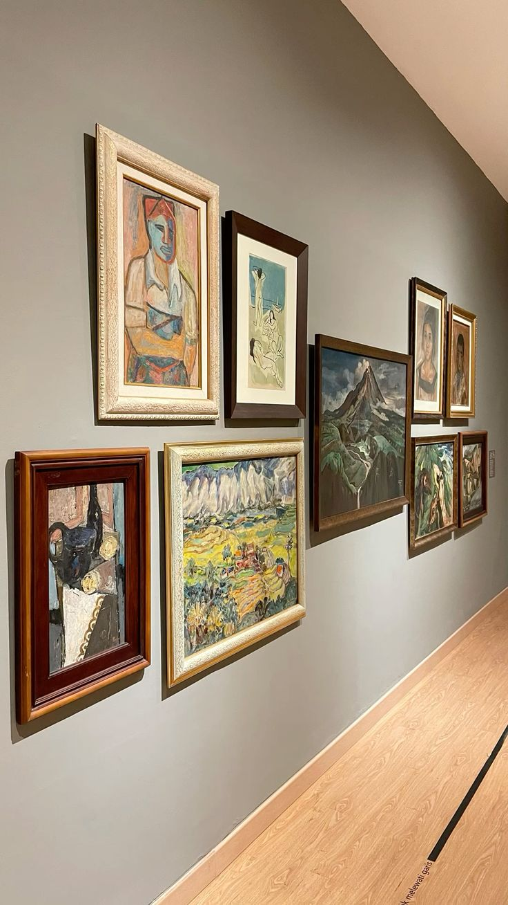
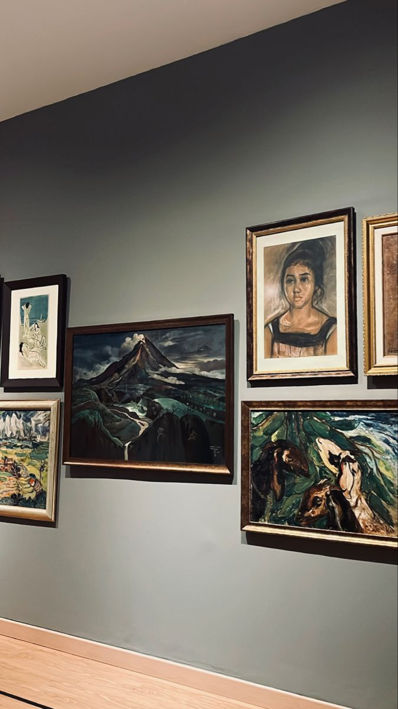

<!doctype html>
<html lang="id"> 
 <head> 
  <meta charset="UTF-8"> 
 </head> 
 <body> 
  <ul> 
   <h1>Galeri Nasional Indonesia</h1> 
  </ul> 
  <meta name="viewport" content="width=device-width, initial-scale=1.0"> 
  <title>Lensa Kreatif | Studio Fotografi &amp; Videografi</title> 
  <link rel="stylesheet" href="style.css"> 
  <header> 
   <nav> 
    <ul> 
     <li><a href="#Deskripsi">Deskripsi</a></li> 
     <li><a href="#Location">Lokasi</a></li> 
     <li><a href="#Picture">Gambar</a></li> 
     <li><a href="#price">Harga</a></li> 
    </ul> 
   </nav> 
  </header> 
  <ul> 
   <h3>Galeri Nasional Indonesia</h3> 
  </ul> 
  <ul> 
   <main class="container"> 
    <section id="Deskripsi"> 
     <h2>Deskripsi <em>Galeri Nasional</em></h2> 
     
 adalah <mark>lembaga budaya dan museum seni rupa</mark> modern-kontemporer negara yang berlokasi di Jakarta Pusat, diresmikan pada 8 Mei 1998. Berfungsi sebagai tempat pameran, konservasi, dan edukasi, GNI menampilkan koleksi seni rupa Indonesia dan mancanegara serta menjadi pusat perkembangan seni rupa di Indonesia.
 
    </section> 
    <section id="Location"> 
     <h1>Lokasi Kami</h1> <iframe src="https://www.google.com/maps/embed?pb=!1m18!1m12!1m3!1d3966.6437821501345!2d106.830023975731!3d-6.1784146605423285!2m3!1f0!2f0!3f0!3m2!1i1024!2i768!4f13.1!3m3!1m2!1s0x2e69f432fb0c95a5%3A0x5a9cae96473931a8!2sGaleri%20Nasional%20Indonesia!5e0!3m2!1sid!2sid!4v1770529423513!5m2!1sid!2sid" width="600" height="450" style="border:0;" allowfullscreen loading="lazy"> </iframe> 
    </section> 
    <section id="Picture" class="gallery"> 
     <h2>Dokumentasi</h2> 
     
 
     
     

      <h3>Showreel Video</h3> 
      <video width="100%" controls> 
       <source src="snaptik_7503139636693273864_v3.mp4" type="video/mp4"> Browser Anda tidak mendukung tag video. 
      </video> 
      <h3>Sampel Audio Podcast</h3> 
      <audio controls> 
       <source src="Moonlight Sonata.mp3" type="audio/mpeg"> Browser Anda tidak mendukung tag audio. 
      </audio> 
     
 
    </section> 
    <section id="price"> 
     <h2>Daftar Harga Paket</h2> 
     <table> 
      <thead> 
       <tr> 
        <th>Kependudukan</th> 
        <th>Usia</th> 
        <th>Harga</th> 
       </tr> 
       <tr> 
        <td rowspan="2">Warga negara Indonesia</td>
        <td>Dewasa</td> 
        <td>Rp 50.000</td> 
       </tr> 
       <tr> 
        <td>Remaja</td> 
        <td>Rp 25.000</td> 
       </tr> 
       </thead>
       <tbody>
       <tr> 
        <td rowspan="2">Warga Negara Asing</td>
        <td>Dewasa</td> 
        <td>150.000</td>
       </tr> 
       <tr>
        <td>Anak anak</td>
        <td>100.000</td>
      </tbody>
     </table> 
    </section> 
   </main> 
   <footer> 
    
© 2026 Galeri nasional indonesia. Dibuat dengan niat.
 
    
instagram : <a href="https://www.instagram.com/galerinasional?igsh=MXUxbHR5M2xpcGNldQ==" style="aquamarine;">@galerinasional</a>
 
   </footer> 
  </ul> 
 </body>
</html># wisata.github.io
